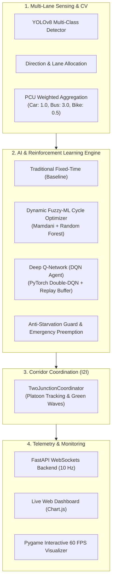

# 🚦 AI-Based Traffic Light Management System

[](https://www.python.org/)
[](https://fastapi.tiangolo.com/)
[](https://pytorch.org/)
[](https://ultralytics.com/)
[]()

> **Course:** IT 3182 — Essentials of Artificial Intelligence  
> **Institution:** General Sir John Kotelawala Defence University (KDU), Faculty of Computing  
> **Group:** 06  

---

## 📌 Executive Summary

Urban traffic congestion results in severe delays, excessive fuel wastage, and increased emissions due to rigid, static fixed-time signal controllers. This project presents an end-to-end **AI-Driven Intelligent Traffic Light Management System** featuring Computer Vision, Dynamic Fuzzy-ML Optimization, Deep Reinforcement Learning (DQN), and Inter-Intersection (I2I) Green Wave Corridor Synchronization.

The system is evaluated via high-fidelity, micro-physics traffic simulations supporting both **Single 4-Way Intersections** and **Connected Multi-Junction Arterial Networks**.

---

## 🌟 Key Features & AI Architecture



### 1. Multi-Class Vehicle Detection & PCU Estimation
- Real-time video/camera detection using **YOLOv8** & **OpenCV**.
- Classifies vehicles: `Car (1.0 PCU)`, `Van (1.5 PCU)`, `Bus (3.0 PCU)`, `Truck (3.0 PCU)`, `Motorcycle (0.5 PCU)`, and `Ambulance (Emergency)`.
- Calculates lane-specific Passenger Car Unit (PCU) queues and arrival flow rates ($v/m$).

### 2. Tri-Modal Traffic Control Paradigms
1. **Mode 1: Traditional Fixed-Time Controller (Baseline):** Static cycle times ($24\text{s}$ green splits) mimicking conventional non-adaptive lights.
2. **Mode 2: Dynamic Fuzzy-ML Cycle Optimizer:** Mamdani Fuzzy Inference Engine augmented with Random Forest regression to dynamically balance green times ($8\text{s} - 38\text{s}$) with starvation prevention.
3. **Mode 3: Deep Reinforcement Learning (DQN):** Multi-objective Bellman RL agent trained with Experience Replay to optimize total network throughput and delay reduction.

### 3. Safety Guards & Emergency Handling
- **Anti-Starvation Safety Hard Ceiling:** Prevents minor approaches from waiting longer than $48\text{s} - 55\text{s}$ regardless of opposing traffic volume.
- **Emergency Ambulance Preemption:** Instantly preempts active phases to clear corridors for emergency vehicles.

### 4. Inter-Intersection (I2I) Green Wave Coordination
- Monitors arterial platoons traveling between connected junctions ($J_1 \leftrightarrow J_2$).
- Computes vehicle Arrival ETA ($\text{Distance} / \text{Speed}$) and coordinates downstream phase preemption to let platoons glide through multiple intersections without stopping.

---

## 📂 Repository Structure

```
AI-Traffic-Light-Management-System/
├── ai_engine/                         # Core AI & Simulation Logic
│   ├── fuzzy_controller/              # Mamdani Fuzzy Logic Controller
│   ├── models/                        # YOLOv8 Computer Vision Pipeline
│   ├── multi_junction/                # Connected 2-Junction Architecture & Coordinator
│   │   ├── junction_node.py           # Junction Node Model & Controller Router
│   │   ├── two_junction_vehicle.py    # Vehicle Physics & Bézier Curve Geometry
│   │   ├── two_junction_coordinator.py# I2I Green Wave Coordination Protocol
│   │   ├── run_two_junction_simulation.py # Interactive 2-Junction Pygame GUI
│   │   └── run_two_junction_benchmark.py  # 5-Hour Multi-Scenario Benchmark Suite
│   ├── rl_agent/                      # Deep Q-Network (DQN) PyTorch Implementation
│   ├── simulation/                    # Single Junction Simulation & Controllers
│   │   ├── controllers.py             # Fixed, Fuzzy, and DQN Signal Controllers
│   │   ├── traffic_signal.py          # Traffic Signal State Machine (8 Phases)
│   │   └── run_simulation.py          # Interactive Single-Junction Pygame GUI
│   ├── traffic_predictor/             # Scikit-Learn Traffic Flow Predictor & DQN Weights
│   └── utils/                         # Metrics, PCU, and Geometry Helpers
│
├── backend/                           # FastAPI REST & WebSocket Telemetry Server
│   ├── app.py                         # Application Entry Point & WebSocket Broadcaster
│   ├── config.py                      # Server Configuration
│   ├── db_service.py                  # Telemetry Fallback & Data Logger
│   └── routes/                        # Intersections, Predictions, Analytics API
│
├── frontend/                          # Web Telemetry Dashboard
│   ├── index.html                     # Live Control Dashboard UI
│   ├── styles.css                     # Dark-Themed Responsive Styles
│   └── app.js                         # WebSocket Consumer & Real-time Chart.js Visualizer
│
├── data/
│   ├── datasets/                      # Training & Synthetic Traffic Data
│   ├── sample_videos/                 # Real-World Intersection Video Feeds
│   └── simulation_reports/            # Automated Scientific Benchmark Results
│       ├── single_junction_reports/   # 24-Hour & 1-Hour Single Intersection Reports & Figures
│       └── two_junction_reports/      # 5-Hour 2-Junction Comparison Reports & Figures
│
├── requirements.txt                   # Project Dependencies
├── run_simulation.bat                 # Single-Junction Interactive Simulation Launcher
├── run_two_junction_simulation.bat    # 2-Junction Connected Simulation Launcher
├── run_all_components.bat             # Full Stack Launcher (Backend + Web Dashboard)
└── run_yolo_monitor.bat               # Real-time Video YOLOv8 Monitoring Launcher
```

---

## ⚡ Quick Start & Installation

### 1. Prerequisites
- **Python 3.10 or 3.11** installed.
- (Optional) NVIDIA GPU with CUDA for accelerated YOLOv8 / PyTorch inference.

### 2. Setup Virtual Environment & Dependencies
```powershell
# Clone or navigate to repository root
cd "E:\Mandila\KDU\Semester 4\Essentials of Artificial Intelligence\AI-Traffic-Light-Management-System"

# Create and activate virtual environment (optional but recommended)
python -m venv venv
.\venv\Scripts\activate

# Install required dependencies
pip install -r requirements.txt
```

---

## 🚀 Running the System

### Option A: One-Click Windows Launchers
- 🎮 **2-Junction Interactive Simulation:** Double-click `run_two_junction_simulation.bat`
- 🎮 **Single-Junction Simulation:** Double-click `run_simulation.bat`
- 🌐 **Full Telemetry Dashboard (FastAPI + Web UI):** Double-click `run_all_components.bat`
- 📹 **YOLOv8 Computer Vision Video Monitor:** Double-click `run_yolo_monitor.bat`

### Option B: Command-Line Execution

#### 1. Run Interactive 2-Junction Simulation
```powershell
python ai_engine\multi_junction\run_two_junction_simulation.py
```

#### 2. Run Interactive Single-Junction Simulation
```powershell
python ai_engine\simulation\run_simulation.py
```

#### 3. Run 5-Hour Scientific Benchmark Suite (2 Connected Junctions)
```powershell
python ai_engine\multi_junction\run_two_junction_benchmark.py
```

#### 4. Run Telemetry Backend Server
```powershell
python backend\app.py
# Access Dashboard at: http://localhost:8000
```

---

## ⌨️ Interactive Simulation Controls

When running the interactive Pygame simulations, use the following hotkeys:

| Key | Action |
| :---: | :--- |
| `[1]` | Switch to **Mode 1: Traditional Fixed-Time Controller** |
| `[2]` | Switch to **Mode 2: Dynamic Fuzzy-ML Cycle Optimizer** |
| `[3]` | Switch to **Mode 3: Deep Reinforcement Learning (DQN)** |
| `[E]` | Inject an **Emergency Ambulance** with priority sirens |
| `[Space]` | **Pause / Resume** the simulation clock |
| `[R]` | **Reset** simulation state and performance metrics |
| `[N] / [S] / [E] / [W]` | Manually increase/decrease approach traffic inflow rates |

---

## 📊 Scientific Benchmark Summary

### 2-Junction Connected Grid (5 Simulated Hours / 18,000s)

| Metric | Traditional Fixed-Time | Dynamic Fuzzy-ML | Deep RL (DQN Agent) |
| :--- | :---: | :---: | :---: |
| **Arterial Rush Hour AWT (EB)** | $20.81\text{ s}$ | $22.02\text{ s}$ | **$13.55\text{ s}$ (Best)** |
| **Cross-Street Surge AWT (N/S)** | $18.85\text{ s}$ | $22.04\text{ s}$ | **$17.22\text{ s}$ (Best)** |
| **Total Cleared Vehicles** | $76,067\text{ veh}$ | **$76,063\text{ veh}$** | $75,922\text{ veh}$ |
| **Total Cleared PCU** | $94,219.0\text{ PCU}$ | **$94,224.4\text{ PCU}$** | $93,977.1\text{ PCU}$ |
| **Safety & Anti-Starvation** | Passive | **Hard Cap Ceiling (<55s)** | **Active Multi-Objective** |
| **Collision Probability** | **0.0%** | **0.0%** | **0.0%** |

*Full evaluation reports and high-resolution figures are located in [`data/simulation_reports/`](file:///E:/Mandila/KDU/Semester%204/Essentials%20of%20Artificial%20Intelligence/AI-Traffic-Light-Management-System/data/simulation_reports/).*

---

## 👥 Authors & Academic Context

**General Sir John Kotelawala Defence University (KDU)**  
**Faculty of Computing — Department of Computer Science & Software Engineering**  
**Module:** IT 3182 — Essentials of Artificial Intelligence  
**Group:** 06  
